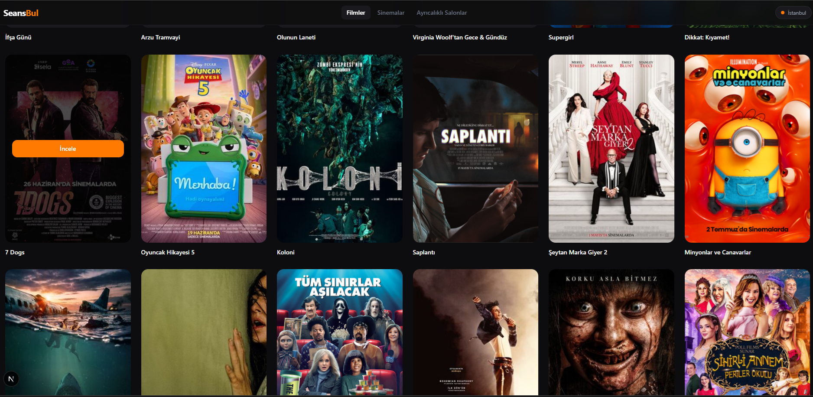
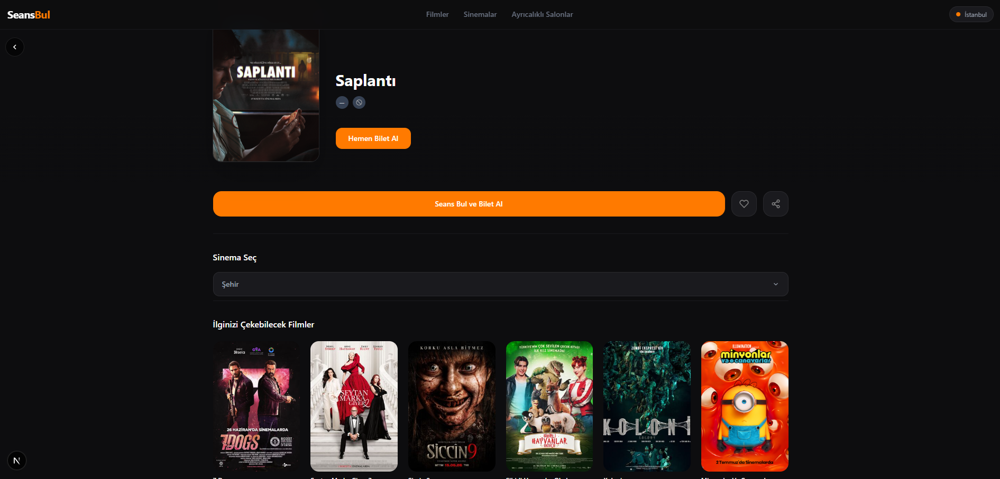
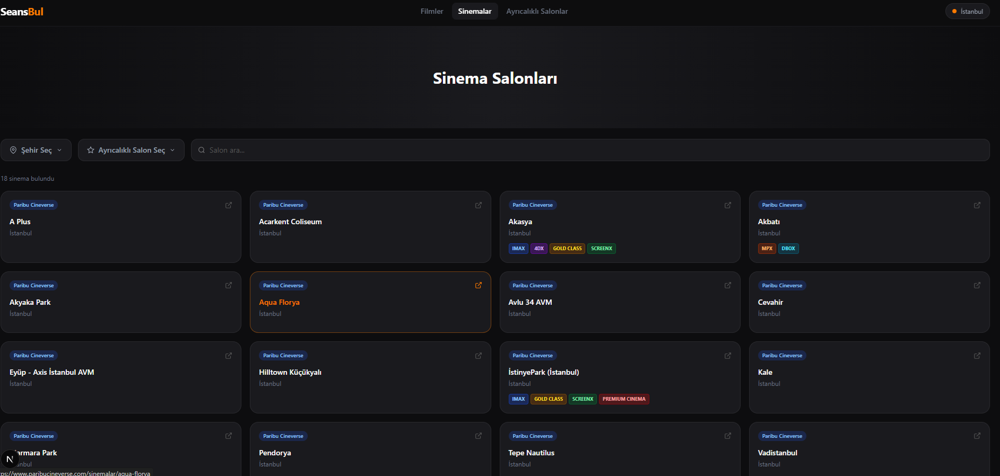
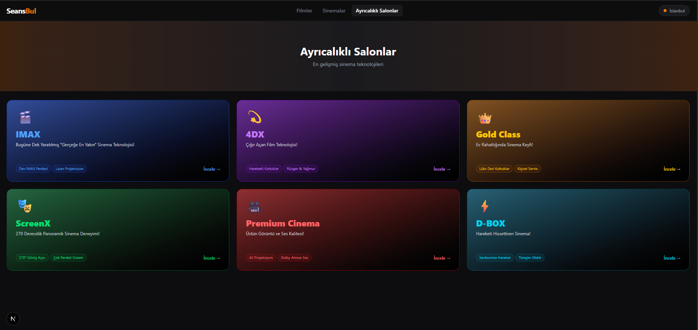

# SeansBul

İstanbul'daki sinemaların güncel seans bilgilerini tek bir yerden aramanı
sağlayan bir platform. Backend, farklı sinema zincirlerinin sitelerinden
(Cinetime, Cineverse/Paribu vb.) seans verilerini otomatik olarak çeker ve
TMDB API'siyle film bilgilerini (afiş, özet, puan) zenginleştirir.

| Film Listesi | Film Detayı |
|---|---|
|  |  |

| Sinema Salonları | Ayrıcalıklı Salonlar |
|---|---|
|  |  |

## Özellikler

- **Otomatik veri toplama**: Her gün saat 06:00'da zamanlanmış görev (scheduler)
  ile sinema seanslarının otomatik güncellenmesi
- **Çoklu kaynak scraping**: Cinetime ve Cineverse gibi farklı sinema
  zincirlerinden Playwright ile veri çekme
- **TMDB entegrasyonu**: Film afişi, özet ve puan bilgilerinin otomatik
  eşleştirilmesi
- **Vizyonda / Yakında ayrımı**: Seansı olan filmler otomatik "vizyonda",
  olmayanlar "yakında" olarak işaretlenir
- **Film, sinema ve seans arama** REST API'leri

## Proje Yapısı

```
backend/           # FastAPI servisi
├── main.py          # API giriş noktası, scheduler
├── database.py       # PostgreSQL bağlantısı (SQLAlchemy)
├── api/                # Films / Cinemas / Sessions endpoint'leri
├── models/              # SQLAlchemy modelleri
└── scrapers/              # Cinetime, Cineverse, TMDB veri toplayıcılar

frontend/          # Next.js (React) arayüzü
└── app/              # Sayfa ve bileşenler (filmler, sinemalar, film detayı)
```

## Kurulum

### Backend

```bash
cd backend
python -m venv venv
venv\Scripts\activate        # Windows
pip install -r requirements.txt

copy .env.example .env       # DATABASE_URL ve TMDB_API_KEY değerlerini gir
```

PostgreSQL'de `seansbul` adında bir veritabanı oluşturulmuş olmalı.
TMDB API anahtarı [themoviedb.org](https://www.themoviedb.org/settings/api)
üzerinden ücretsiz alınabilir.

### Frontend

```bash
cd frontend
npm install
```

## Çalıştırma

İki servisi de ayrı terminallerde çalıştırmak gerekir:

```bash
# Backend (http://localhost:8000)
cd backend
venv\Scripts\activate
uvicorn main:app --reload

# Frontend (http://localhost:3000)
cd frontend
npm run dev
```

## Kullanılan Teknolojiler

### Backend

- **Python** — ana dil
- **FastAPI** — REST API framework'ü
- **Uvicorn** — ASGI sunucusu (FastAPI'yi çalıştırır)
- **SQLAlchemy** — ORM, veritabanı modelleri ve sorguları
- **PostgreSQL** (`psycopg2-binary` sürücüsüyle) — ana veritabanı
- **APScheduler** — her gün otomatik veri çekme için zamanlanmış görev (cron)
- **Playwright** — sinema sitelerinden (Cinetime, Cineverse) seans ve poster
  verisini tarayıcı otomasyonuyla çekme (web scraping)
- **httpx / requests** — TMDB API'sine HTTP istekleri
- **python-dotenv** — ortam değişkeni (`.env`) yönetimi

### Frontend

- **Next.js 16** (App Router) — React tabanlı framework, sayfa yönlendirme
  ve sunucu/istemci bileşenleri
- **React 19** — arayüz bileşenleri
- **TypeScript** — tip güvenliği
- **Tailwind CSS 4** — stil/tasarım
- **Node.js** — Next.js'in çalıştığı JavaScript ortamı (paket yönetimi: npm)

### Dış Servisler

- **TMDB (The Movie Database) API** — film afişi, özet, puan gibi meta veriler
